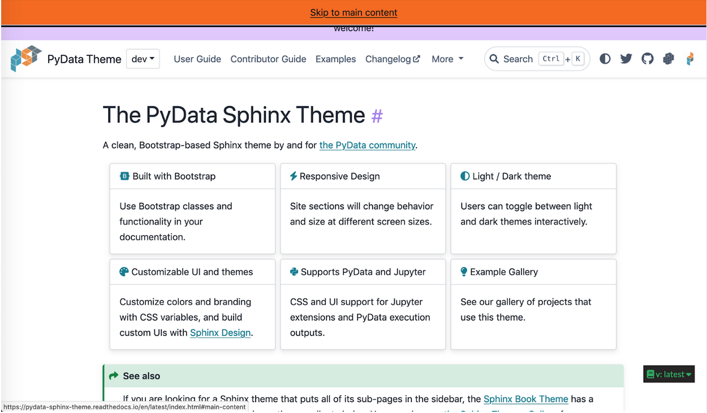
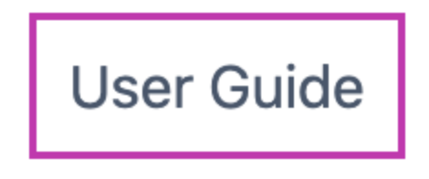
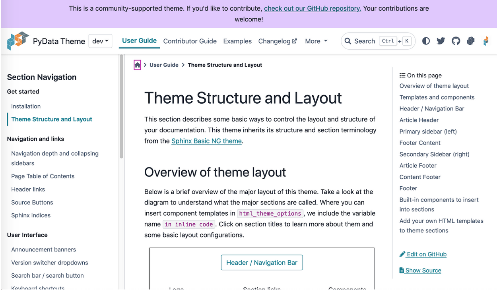

# PyData Sphinx Docs - Collaborative keyboard navigation review

Please add your findings as [GitHub suggestions](https://docs.github.com/en/pull-requests/collaborating-with-pull-requests/reviewing-changes-in-pull-requests/commenting-on-a-pull-request) so you are credited in the commit history!

## Keyboard navigation accessibility review of [tool name]

Reviewed via based on [this link we'll all be working off of](https://pydata-sphinx-theme.readthedocs.io/en/latest/).

- Review date: 2023 July 10
- Operating system (s):
- Browser (s): 
- Keyboard language(s) used:
- Any other details (ie. dependencies, github repo, etc.):

### Authors and contents

Please add your name to the test(s) you plan to undetake via [GitHub suggestions](https://docs.github.com/en/pull-requests/collaborating-with-pull-requests/reviewing-changes-in-pull-requests/commenting-on-a-pull-request) so you are credited in the commit history!

- Content order: @smeragoel
- Keyboard/tab traps: @gabalafou 
- Skip links: @isabela-pf 
- Focus: @steff456 

## Review

For this review, participants select a test they would like to complete and apply it to as many areas or states of the interface as they want in the given time. There are two pages with different structure to be reviewed below, the [Home page](https://pydata-sphinx-theme.readthedocs.io/en/latest/index.html) and the [Theme Structure and Layout page](https://pydata-sphinx-theme.readthedocs.io/en/latest/user_guide/layout.html).

### General notes

This is the place for anything a reviewer thinks is important that doesn't belong below. This could be something out of scope of the review, something that will impact all other tests, or the like.

Notes:

### [Home page](https://pydata-sphinx-theme.readthedocs.io/en/latest/index.html) review

#### Content order

When accessed via keyboard, the content order is logical. ([WCAG 2.2 Focus order](https://www.w3.org/TR/WCAG22/#focus-order))

1. From the top of the page, press the Tab key repeatedly until reviewer reaches the end of content.
2. Reviewers will know it is the end because if they press Tab once more their keyboard focus will return to the browser.
3. If the reviewer cannot make it to the end of content, please take note of where the focus gets stuck.

Does the content order follow reviewer expectations based on reading the content?
Result:Yes

Does the content order make sense for interacting with the content?
Result: Yes

Are any major content areas missed when navigating via keyboard?
Result: No

Are any interactive content areas missed when navigating via keyboard?
Result:  I didn’t find a way to interact with the “Back to Top” button via keyboard.

Other notes or recommendations:

#### Keyboard/tab traps

When navigating via keyboard, there are no areas where keyboard focus can enter but not exit. The focus never gets "trapped." ([WCAG 2.2 No keyboard trap](https://www.w3.org/TR/WCAG22/#no-keyboard-trap))

1. From the top of the page, press the Tab key repeatedly until reviewer reaches the end of content.
2. Reviewers will know it is the end because if they press Tab once more their keyboard focus will return to the browser.
3. If the reviewer cannot make it to the end of content, please take note of where the focus gets stuck. If the reviewer can make it to all content, please note.
4. Optional: complete steps 1–3 over any areas that may have been missed by the content order. Using the mouse to move focus to an area and trying to tab out may be helpful for these cases.

Keyboard/tab traps:
- tab trap 1
- tab trap 2

Other notes or recommendations:

[@gabalafou]: I did not find any tab traps. I checked several different pages: 

- [home](https://pydata-sphinx-theme.readthedocs.io/en/latest/index.html)
- [kitchen sink](https://pydata-sphinx-theme.readthedocs.io/en/latest/examples/kitchen-sink/index.html)
- [PyData library styles](https://pydata-sphinx-theme.readthedocs.io/en/latest/examples/pydata.html)
- [execution libraries](https://pydata-sphinx-theme.readthedocs.io/en/latest/examples/execution.html)
- and more

I doubt there are any tab traps on this site because it is not a very interactive site. 

#### Skip links

When using keyboard navigation, there is a link to switch keyboard focus directly to the tool's main content and skip header navigation or repeated content. ([WCAG 2.2 Bypass Blocks](https://www.w3.org/TR/WCAG22/#bypass-blocks))

1. From the top of the page, press the Tab key. If you have already been interacting with the page, reviewer may need to reload page and then press Tab.
2. Once focus is on the skip link, press Space or Enter to activate it.  

Is there a skip link?
Result: Yes.

Is the skip link prompt visible?
Result: Yes (but it’s pushing low contrast). I do like that it takes up the full width of the page to help it not get lost in other content.

What does the skip link prompt skip?
Result: It skips the entire menu bar area: logo, User Guide, Contributor Guide, Examples, Changelog, More, Search, Theme, and social links.

Where does the skip link prompt move user focus to?
Result: It changes focus to the text directly before the cards.

Does the skip link behavior meet reviewer expectations?
Result: Yes. It changes focus to the page’s main content immediately.

Other notes or recommendations: Review for potential low contrast prompt. Please add a visible focus state, because it did not appear on the banner and made it challenging to know whether I was on the skip link and where I was sent after.

#### Focus

There is a visible focus state for all content. It appears by default when navigating via keyboard. ([WCAG 2.2 Focus visible](https://www.w3.org/TR/WCAG22/#focus-visible))

1. From the top of the page, press the Tab key repeatedly until reviewer reaches the end of content. 
2. If end of content cannot be reached, the reviewer may report on what they could interact with.
3. If the reviewer is comfortable, they may also use the browser inspector to select an area and toggle focus per area.

Is there visible focus styling? If so, please briefly describe it.
Result: In the home page, there’s a visible focus defined by a pink box.

This pink box is still used in the Theme structure and layout page

Is the focus styling consistent throughout?
Result: The focus styling is consistent throughout the homepage and the other page

Are there any areas without visible focus styling?
Result: Not in the homepage, but in the Theme structure and layout page, the focus is lost in the main content area. Meaning that titles don’t have a visible focus and cells as well.

Was the reviewer ever unclear about where their keyboard focus was during the review? If so, please note where or why.
Result: The homepage is always clear where the focus is.

In the main content area there’s no keyboard focus, for instance the focus is somewhere in the screenshot but it is not visible.

Other notes or recommendations: The skip link doesn’t have a focus ring (or other focus indicator… other than appearing on tab, is that sufficient? I feel like most major sites with a skip link put a focus ring around the actual hyperlink text)

#### [Theme Structure and Layout page](https://pydata-sphinx-theme.readthedocs.io/en/latest/user_guide/layout.html) review

#### Skip links

When using keyboard navigation, there is a link to switch keyboard focus directly to the tool's main content and skip header navigation or repeated content. ([WCAG 2.2 Bypass Blocks](https://www.w3.org/TR/WCAG22/#bypass-blocks))

1. From the top of the page, press the Tab key. If you have already been interacting with the page, reviewer may need to reload page and then press Tab.
2. Once focus is on the skip link, press Space or Enter to activate it.  

Is there a skip link?
Result: Yes.

Is the skip link prompt visible?
Result: Yes. It is styled the same as on the Home page.

What does the skip link prompt skip?
Result: It skips the entire menu bar area and sidebar/Section Navigation: logo, User Guide, Contributor Guide, Examples, Changelog, More, Search, Theme, social links, and right side bar Section Navigation in its entirety.

Where does the skip link prompt move user focus to?
Result: It changes focus to the main content container (does not have visible focus and this is probably correct), basically right before the breadcrumbs at the top of the documentation page. (Breadcrumbs are shown in focus in the following screen shot.)

Does the skip link behavior meet reviewer expectations?
Result: Approximately. I personally expected it to go directly to the text of the main content because that is, ultimately, the main content itself. Given how this theme is section heavy, though, I think it makes sense it would go to the whole container.

Other notes or recommendations: I would consider it an ideal state to jump to the first heading on the page instead on the main content container, but this current behavior does allow the user to skip major portions of the navigation so I don’t think it’s incorrect in its current form. The reason I think this is because being put directly into breadcrumbs (a lower level navigation) right after presumably skipping navigation seems mildly misguided. The breadcrumbs will also cause the title of the page to be read twice in a row as they navigate from breadcrumb to actual page heading. This is not a critical recommendation.
